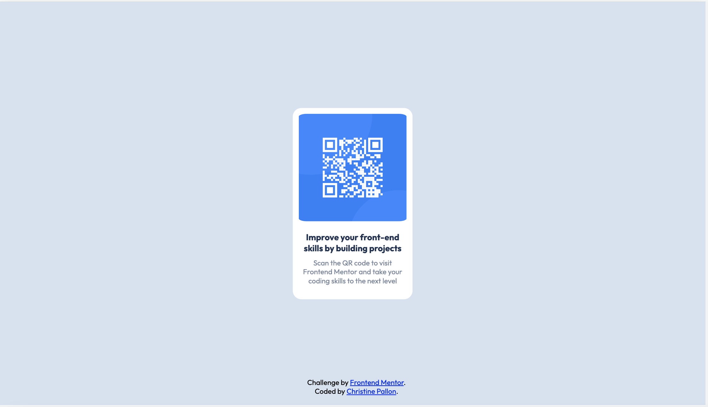

# Frontend Mentor - QR code component solution

This is a solution to the [QR code component challenge on Frontend Mentor](https://www.frontendmentor.io/challenges/qr-code-component-iux_sIO_H). Frontend Mentor challenges help you improve your coding skills by building realistic projects. 

## Table of contents

- [Overview](#overview)
  - [Screenshot](#screenshot)
- [My process](#my-process)
  - [Built with](#built-with)
  - [What I learned](#what-i-learned)
  - [Continued development](#continued-development)
- [Author](#author)

## Overview

### Screenshot

## My process

### Built with

- Semantic HTML5 markup
- CSS custom properties
- Flexbox

Using VisualCodeStudio!

### What I learned

This project helped me a great deal with reinforcing my understanding of both Flexbox and positioning elements on a page.

### Continued development

I plan to continue getting more and more comfortable with Flexbox, as this is still an area I struggle with. I understand the basic concepts but still need to do quite a bit of Googling to get what I want, which adds  a lot of time to my workflow. With more practice, I hope to become more confident and not need to look things up as frequently.

## Author

- Git - [christinepallon](https://github.com/christinepallon)
- Frontend Mentor - [@christinepallon](https://www.frontendmentor.io/profile/christinepallon)
- Twitter - [@xtine_files](https://www.twitter.com/xtine_files)
